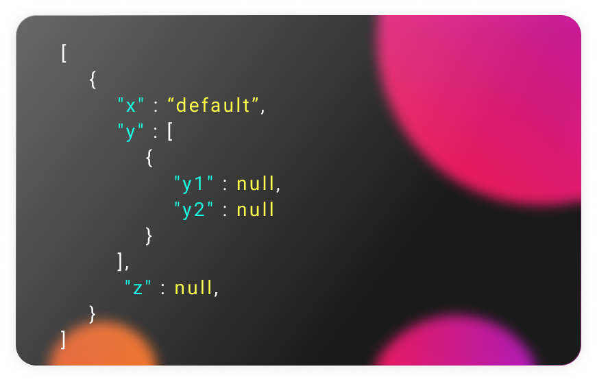

# json-data-filler
<h4>this Script is design to fill json data in the way user wants</h4>
<h2>💻 Schema defines the structure user wants for the data and based on that data will be filled in json file and shape accordingly.</h2>
<h4>define your json files in test.py file and run it to get output.json file</h4>
<h1>schema ---></h1>

<h1>raw data ---></h1>

<h1>output data ---></h1>

 
 

<h1>happy hacking  ; </h1>
